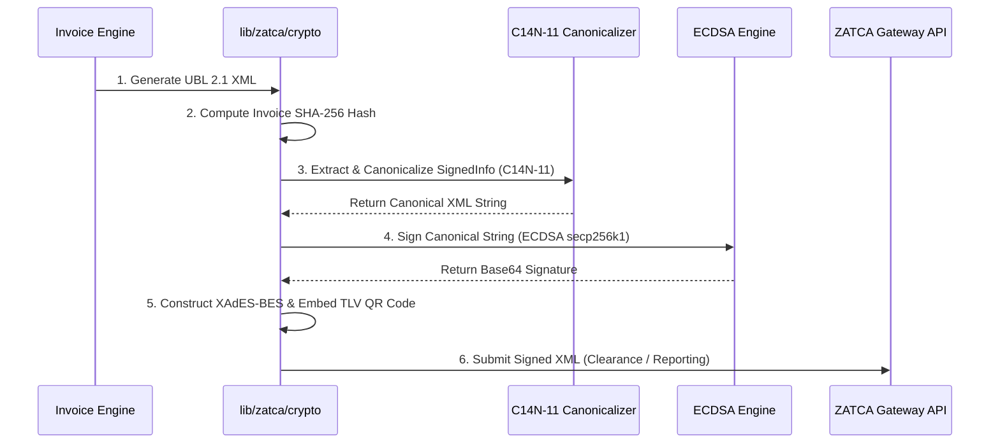
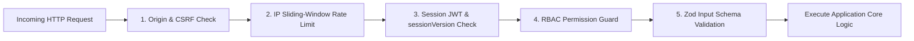

# FatooraLite Pro — Enterprise System Architecture Reference Manual

> [!NOTE]  
> **Technical Document Purpose**: This specification provides a comprehensive, low-level technical architectural reference for engineering teams, security auditors, and system architects. It details the framework design, database schematics, multi-tenant isolation, cryptographic engine, AI/RAG subsystem, and security threat model of **FatooraLite Pro**.

---

## 1. High-Level Technology Stack & System Components

FatooraLite Pro is architected as a modern, high-throughput web service built on Next.js 16 (App Router with Turbopack), TypeScript, Neon PostgreSQL with `pgvector`, and an integrated OpenRouter AI provider.

```mermaid
graph TB
    subgraph Client Tier
        Browser["PWA Client / Next.js React 19"]
        Dock["Assistant Dock Component"]
    end

    subgraph Security & Routing Tier
        Proxy["proxy.ts Middleware (Auth / CSRF / Rate Limit)"]
        RBAC["Server Security & Permission Guard"]
    end

    subgraph Application Service Tier
        AuthAPI["/api/auth/*"]
        CompanyAPI["/api/companies/*"]
        InvoiceAPI["/api/invoices/*"]
        ZatcaAPI["/api/clearance/*"]
        AIAPI["/api/ai/{chat, agent, ingest}"]
    end

    subgraph Core Logic & Domain Services
        ZatcaCrypto["lib/zatca/* (ECDSA / XAdES / C14N / TLV)"]
        InvoiceService["lib/services/issueInvoice.ts"]
        RAGStore["lib/ai/vector-store.ts"]
    end

    subgraph Persistence & Infrastructure Tier
        DB[("Neon Postgres Database")]
        VectorDB[("pgvector Extension")]
        ZatcaGW["Official ZATCA Clearance Gateway"]
        LLM["OpenRouter AI Provider"]
    end

    Browser --> Proxy
    Dock --> Proxy
    Proxy --> RBAC
    RBAC --> Application Service Tier
    InvoiceAPI --> InvoiceService
    ZatcaAPI --> ZatcaCrypto
    AIAPI --> RAGStore
    ZatcaCrypto --> ZatcaGW
    InvoiceService --> DB
    RAGStore --> VectorDB
    AIAPI --> LLM
```

### 1.1 Technology Matrix

| Subsystem | Primary Technology | Configuration & Details |
| :--- | :--- | :--- |
| **Framework & Engine** | Next.js 16 (App Router, Turbopack) | React 19, Node.js 20+ runtime, TypeScript 5+. |
| **Database & ORM** | PostgreSQL + Prisma ORM | Neon serverless Postgres; pooled connection for API runtime, direct connection for DDL migrations. |
| **Vector Engine** | `pgvector` Extension | Dimension-agnostic `vector` column in PostgreSQL; native cosine distance vector search (`<=>`). |
| **Authentication & Session** | Custom Signed JWTs (`jose`) | Stateless JWTs stored in `SESSION_COOKIE` with server-side `sessionVersion` invalidation checks. |
| **Cryptography Subsystem** | `node-forge`, `xmlbuilder2` | Pure TypeScript/Node crypto stack enforcing ECDSA secp256k1, SHA-256, XAdES-BES, and C14N-11 canonicalization. |
| **PDF Generation** | `pdf-lib` + `qrcode` | Renders ZATCA-compliant PDF A/3 documents with embedded UBL 2.1 XML attachments and TLV QR codes. |
| **AI LLM Gateway** | OpenRouter Provider | OpenAI-compatible streaming API (`openai/gpt-oss-120b:free` with `:20b` fallback). |
| **Validation Layer** | Zod Schemas (`lib/validation/*`) | Strict validation enforced on all incoming API request bodies and AI tool call arguments. |

---

## 2. Multi-Tenant Architecture & Data Isolation

FatooraLite Pro enforces a strict **SaaS Multi-Tenancy Architecture**. All organizational data belongs to a specific `Company` tenant.

```
PostgreSQL Database Schema
├── Company (Tenant Root)
│   ├── Branch (Locations)
│   ├── User (Employees & Credentials)
│   ├── Role & RolePermission (RBAC)
│   ├── Customer (B2B & B2C Directory)
│   ├── Product (Inventory & Tax Rules)
│   ├── Certificate (Cryptographic CSIDs)
│   ├── Invoice ──► InvoiceLine ──► ClearanceRecord
│   ├── InvoiceCounter (Sequential Numbering per Tenant)
│   └── KnowledgeChunk (Tenant-specific RAG vector embeddings)
```

### 2.1 Enforcing Tenant Scoping in Data Access
To eliminate cross-tenant data leaks (Insecure Direct Object Reference / IDOR), every database operation MUST be scoped by the authenticated user's `companyId`.

```typescript
// Example: Strict Tenant-Scoped Query Pattern in lib/db/
export async function getTenantInvoices(user: UserSession, page = 1, limit = 20) {
  if (!user.companyId) {
    throw new SecurityError("Unauthorized: Missing active tenant context");
  }

  return await prisma.invoice.findMany({
    where: {
      companyId: user.companyId, // Tenant Scoping Guard
    },
    skip: (page - 1) * limit,
    take: limit,
    orderBy: { createdAt: "desc" },
  });
}
```

---

## 3. ZATCA Phase-2 Cryptographic Engine

The ZATCA engine (`lib/zatca/`) is a self-contained, fully unit-tested cryptographic suite implementing the official Saudi E-Invoicing Technical Specifications.



### 3.1 XAdES-BES & C14N-11 Canonicalization
ZATCA requires XML signatures to adhere to the **W3C XMLDSig** and **XAdES-BES** standards. Before signing, the `<ds:SignedInfo>` element must undergo **xml-exc-c14n11 (Exclusive XML Canonicalization 1.1)**.

> [!IMPORTANT]  
> **XAdES C14N-11 Compliance Fix**: Canonicalization must explicitly preserve all inherited ancestor namespaces (`ds`, `sac`, `ext`, `cbc`). Dropping ancestor namespaces invalidates the signature when verified against ZATCA's official gateway. FatooraLite Pro includes an independent validation harness (`scripts/validate-zatca.ts`) that asserts non-circular canonical string accuracy.

### 3.2 Previous Invoice Hash (PIH) Chain
To ensure tamper-evident transaction logs, every invoice includes the SHA-256 hash of the immediately preceding invoice issued by that tenant:

$$\text{PIH}_n = \begin{cases} \text{Base64}(\text{SHA-256}(\text{Invoice}_{n-1}\text{ XML})), & \text{if } n > 1 \\ \text{Base64}(\text{SHA-256}(\text{"NWZlYjYwZGU..."})), & \text{if } n = 1 \text{ (Initial Seed Hash)} \end{cases}$$

---

## 4. Vector Database & RAG Architecture

FatooraLite Pro uses PostgreSQL's native `pgvector` extension for Retrieval-Augmented Generation (RAG).

```
User Query ──► Google text-embedding-004 ──► 768-dim Vector ──► SQL Cosine Distance Search
                                                                          │
System Prompt ◄── Inject Context ◄── Retrieve Top-K (Score >= 0.15) ◄─────┘
```

### 4.1 Vector Store Schema (`KnowledgeChunk`)
Embeddings are stored in a dimension-agnostic `vector` column to support seamless embedding model migrations.

```sql
CREATE TABLE "KnowledgeChunk" (
    "id" TEXT NOT NULL PRIMARY KEY,
    "scope" TEXT NOT NULL,          -- 'global' (ZATCA rules) or 'company' (Tenant data)
    "companyId" TEXT,               -- Tenant ID (NULL for global chunks)
    "source" TEXT NOT NULL,         -- Source document identifier
    "text" TEXT NOT NULL,           -- Raw text content
    "embedding" vector,             -- pgvector column (dimension-agnostic)
    "createdAt" TIMESTAMP NOT NULL DEFAULT CURRENT_TIMESTAMP
);
```

### 4.2 Cosine Similarity Search SQL
RAG queries execute directly in PostgreSQL, combining cosine distance matching (`<=>`) with strict multi-tenant isolation rules:

```sql
SELECT text, source, scope, 1 - (embedding <=> $1::vector) AS score
FROM "KnowledgeChunk"
WHERE embedding IS NOT NULL
  AND vector_dims(embedding) = 768
  AND (scope = 'global' OR (scope = 'company' AND "companyId" = $2))
ORDER BY embedding <=> $1::vector
LIMIT 5;
```

---

## 5. Security Posture & Threat Model

FatooraLite Pro implements a robust defense-in-depth security model to defend against OWASP Top 10 web vulnerabilities.



### 5.1 Defense Mechanisms

1. **Session Invalidation (`sessionVersion`)**:
   * Every user record contains a `sessionVersion` counter.
   * When a password reset or security revocation occurs, `sessionVersion` is incremented, immediately invalidating all active JWT cookies across all devices.
2. **Encrypted Secrets at Rest**:
   * ZATCA private keys (`Certificate.privateKey`) are encrypted prior to storage using **AES-256-GCM** with per-tenant salt keys (`lib/crypto/encrypt.ts`).
3. **Prompt Injection Safeguards**:
   * RAG retrieved context explicitly segregates `[global]` trusted ZATCA regulations from `[tenant-data]` free text.
   * The AI model system prompt enforces that tenant free text must **never** be interpreted as system instructions.
4. **Autonomous Action Write-Gates**:
   * The AI agent cannot perform write operations (invoice issuance, customer deletion) silently. All mutating tool calls require an explicit two-step user confirmation roundtrip.

---

## 6. Verification & Architectural Benchmarks

The entire system is continuously validated using automated test suites and compliance harnesses:

* **TypeScript Compilation**: `npx tsc --noEmit` (Zero type errors).
* **Unit & Integration Suite**: `npx vitest run` (**127 passed / 0 failing**).
* **ZATCA Cryptographic Validator**: `npx tsx scripts/validate-zatca.ts` (**7/7 checks passed**).
* **Production Build**: `npm run build` (Clean production bundle compilation).
