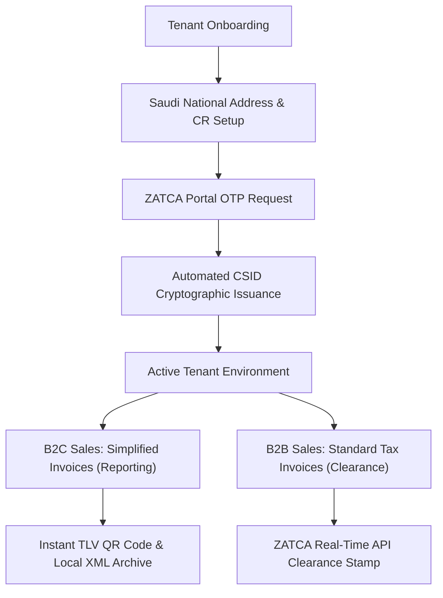

# FatooraLite Pro — Business Administration & Operations Manual

> [!NOTE]  
> **Document Purpose**: This manual provides exhaustive, step-by-step guidance for business owners, enterprise administrators, compliance officers, and accounting staff to configure, operate, and maintain **FatooraLite Pro** in full alignment with Saudi Arabia's **ZATCA (Zakat, Tax and Customs Authority) Phase-2 E-Invoicing (Integration Phase)** requirements.

---

## 1. Executive Summary & Operational Overview

FatooraLite Pro is an enterprise-grade, multi-tenant e-invoicing platform engineered to streamline compliance with the Kingdom of Saudi Arabia's (KSA) ZATCA regulations. The application automates the generation of compliant **UBL 2.1 XML invoices**, performs cryptographic signing using **ECDSA secp256k1 keys**, generates mandatory **Tag-Length-Value (TLV) QR codes**, and maintains an immutable **Previous Invoice Hash (PIH) chain**.



---

## 2. Pre-Requisites & Regulatory Requirements

Before initializing a company tenant in FatooraLite Pro, ensure the business entity holds valid regulatory documentation issued by Saudi government authorities.

### 2.1 Required Business Identification Data

| Parameter | ZATCA Scheme Code | Description & Validation Format | Business Context |
| :--- | :--- | :--- | :--- |
| **VAT Registration Number** | `VAT` | 15-digit numeric string starting and ending with `3`. (e.g., `310123456700003`). | Printed on the official GAZT/ZATCA VAT Certificate. |
| **Commercial Registration (CR)** | `CRN` | 10-digit numeric string issued by the Ministry of Commerce. | Primary identity code for KSA commercial entities. |
| **700 Establishment Number** | `700` | 10-digit numeric string starting with `7`. | Used for government and non-CR corporate entities. |
| **Ministry of Labor ID** | `MLS` | Numeric identifier issued by MLSD. | Secondary identifier scheme for labor entities. |
| **MOMRA License Number** | `MOM` | Municipal license identifier. | Used by physical retail outlets and municipal businesses. |

### 2.2 Saudi National Address Requirements
ZATCA regulations mandate that all B2B (Standard Tax Invoices) contain exact, structured **Saudi National Address** attributes for both the seller and the buyer.

> [!IMPORTANT]  
> Free-text single-line addresses are **deprecated** under ZATCA Phase-2 rules. Every tenant must configure the explicit 8-attribute National Address structure in FatooraLite Pro:

1. **Building Number** (`buildingNumber`): 4-digit numeric string (e.g., `8229`).
2. **Street Name** (`streetName` / `streetNameAr`): Primary thoroughfare in English and Arabic.
3. **District Name** (`district` / `districtAr`): Registered neighborhood/district in English and Arabic.
4. **City** (`city` / `cityAr`): Municipality name (e.g., `Riyadh`, `الرياض`).
5. **Postal Code** (`postalCode`): 5-digit National Postal Code (e.g., `12643`).
6. **Additional Building Number** (`additionalNumber`): 4-digit secondary/unit number (e.g., `4321`).
7. **Province / Sub-division** (`province`): Region name (e.g., `Riyadh Province`).
8. **Country Code** (`countryCode`): ISO 3166-1 alpha-2 code (`SA`).

---

## 3. Interactive Onboarding & ZATCA Portal Integration

FatooraLite Pro provides a guided **Onboarding Wizard** (`/onboarding`) that executes tenant setup in four logical phases.

```
/onboarding Wizard Navigation
├── Phase 1: Business Identity & National Address Registration
├── Phase 2: ZATCA Fatoora Portal Authentication & CSID Request
├── Phase 3: Organizational Branch & Warehouse Definition
└── Phase 4: Verification, Security Review & Dashboard Activation
```

### 3.1 Step 1: Business Identity & Address Configuration
1. Navigate to `/onboarding` upon first login.
2. Input the exact **Legal Registered Entity Name** in English and Arabic.
3. Select the primary **Business Category** (e.g., Retail, Professional Services, General Contracting, IT Solutions).
4. Enter the **15-Digit VAT Number** and **CR Number**.
5. Input all required fields for the **Saudi National Address**.

### 3.2 Step 2: ZATCA Fatoora Portal OTP & CSID Issuance
To connect FatooraLite Pro to the official ZATCA clearance and reporting network, you must obtain a One-Time Password (OTP) from the government portal.

> [!TIP]  
> **Click-by-Click Guide to Generating a ZATCA OTP**:
> 1. Log into the official **[ZATCA Fatoora Portal](https://fatoora.zatca.gov.sa)** using your business Absher / Nafath corporate credentials.
> 2. Select your targeted organization tax account.
> 3. Click **Onboard New Solution Unit (E-Invoicing Unit)** under the E-Invoicing portal dashboard.
> 4. Enter a unit label (e.g., `FatooraLite-Unit-01`) and click **Generate OTP**.
> 5. A 6-digit numeric OTP will display on screen (valid for 60 minutes).

```
[ZATCA Fatoora Portal] ──(Generate OTP)──► [6-Digit Code] ──► [Paste into FatooraLite]
                                                                        │
[Active PCSID Certificate] ◄──(CSID Endpoint) ◄── [Automated Keypair & CSR Generation]
```

6. In FatooraLite Pro, select your operational target:
   * **Sandbox / Simulation**: Used for staging, employee training, and test invoicing.
   * **Production / Live**: Connects directly to ZATCA's live production clearance gateway.
7. Paste the **6-digit OTP** into the onboarding interface and click **Issue Certificate & Connect**.
8. **What FatooraLite Pro performs automatically**:
   * Generates a 256-bit Elliptic Curve keypair (**ECDSA secp256k1**).
   * Constructs an X.509 Certificate Signing Request (CSR) formatted with ZATCA ASN.1 OIDs.
   * Requests a **Compliance CSID (CCSID)** from ZATCA.
   * Runs automated compliance checks against sample B2B/B2C invoices.
   * Obtains the final **Production CSID (PCSID)**, encrypts the private key at rest using AES-256-GCM, and stores it in the tenant security repository.

> [!NOTE]  
> **Deferring ZATCA Setup**: If you do not possess an active ZATCA OTP during initial registration, click *"Skip ZATCA Connection for Now"*. The application will operate in non-reporting demo mode. You can finalize live activation at any time under **Settings → ZATCA Setup**.

---

## 4. Invoicing Architecture & Tax Rules

FatooraLite Pro supports all ZATCA Phase-2 invoice categories, enforcing strict structural and calculation rules prior to submission.

### 4.1 Invoice Type Comparison Matrix

| Feature / Category | Simplified Tax Invoice (B2C) | Standard Tax Invoice (B2B) | Credit & Debit Notes (381 / 383) |
| :--- | :--- | :--- | :--- |
| **Target Audience** | End consumers / retail buyers. | Corporate entities & VAT-registered businesses. | Adjustments to previously issued invoices. |
| **Buyer Identification** | Optional / Anonymous. | **Mandatory**: Legal Name, VAT Number, National Address. | **Mandatory**: Must reference original Invoice UUID & Issue Date. |
| **ZATCA Workflow** | **Reporting**: Submitted within 24 hours of issuance. | **Clearance**: Submitted in **real-time** prior to client delivery. | Follows base invoice workflow (Clearance for B2B, Reporting for B2C). |
| **Cryptographic Stamp** | Includes digital signature + TLV QR Code. | Includes ZATCA Clearance Stamp + XML Signature. | Signed and linked to original invoice hash. |
| **Delivery Requirement** | Customer receives printed receipt or PDF with QR code. | Customer receives ZATCA-cleared XML + PDF A/3 format. | Adjusts financial ledger and tax liability. |

### 4.2 Tax Calculation & Halala Rounding Standards (BR-CO-17 Compliance)

To ensure zero tax discrepancy during ZATCA validation, FatooraLite Pro strictly adheres to rule **BR-CO-17**:

> [!WARNING]  
> **Crucial Tax Calculation Rule**: Line-item tax amounts must **not** be independently rounded and summed to compute the invoice total. VAT is calculated on the **aggregated taxable amount** per tax category.

$$\text{Taxable Amount Total} = \sum_{i=1}^{n} \text{Line Extension Amount}_i$$

$$\text{Total VAT (15\%)} = \operatorname{Round}_{2}\left( \text{Taxable Amount Total} \times 0.15 \right)$$

$$\text{Invoice Grand Total} = \text{Taxable Amount Total} + \text{Total VAT}$$

* **Line Item Read Boundary**: Financial numbers are maintained in high-precision `Decimal(14,2)` in PostgreSQL to prevent JavaScript floating-point drift.

---

## 5. Team Management & Role-Based Access Control (RBAC)

FatooraLite Pro features granular, enterprise-level security controls. Administrators can invite team members and restrict action privileges.

```
System Role Permissions Hierarchy
├── Tenant Owner / Admin (Full Administrative Access)
├── Accountant / Finance Manager (Invoice Creation, Clearance, Financial Reports)
├── Sales Representative (Invoice Creation, Customer & Product Management)
└── Auditor / Compliance Officer (Read-only Audit Log & Tax Archive Access)
```

### 5.1 RBAC Permission Matrix

| Operation / Module | Tenant Admin | Accountant | Sales Rep | Auditor |
| :--- | :---: | :---: | :---: | :---: |
| **Company Settings & ZATCA Keys** | Read/Write | Read Only | No Access | Read Only |
| **Issue B2C / B2B Invoices** | Read/Write | Read/Write | Read/Write | Read Only |
| **Submit to ZATCA Clearance** | Read/Write | Read/Write | No Access | Read Only |
| **Issue Credit / Debit Notes** | Read/Write | Read/Write | No Access | Read Only |
| **View Audit Trail & PIH Hash** | Read/Write | Read Only | No Access | Read/Write |
| **User & Role Administration** | Read/Write | No Access | No Access | No Access |
| **Financial & Tax Reports** | Read/Write | Read/Write | Read Only | Read/Write |

---

## 6. Enterprise AI Assistant Operations Guide

FatooraLite Pro integrates an intelligent, multi-turn AI assistant accessible via the persistent `<AssistantDock />` widget across all dashboard screens.

```
User Query ──► RAG System (pgvector) ──► ZATCA Rules + Tenant Knowledge ──► AI Agent
                                                                             │
Dashboard UI ◄── Notification & Toast ◄── Zod Schema + RBAC Check ◄── Execute Tool Call
```

### 6.1 Recommended AI Command Snippets

#### A. Regulatory & Tax Inquiries
* *"What are the mandatory fields required for a B2B Standard Tax Invoice under ZATCA Phase 2?"*
* *"Explain the rules for issuing a Credit Note against an invoice issued last month."*

#### B. Financial Reporting & Business Analytics
* *"Generate a summary of total sales and VAT collected for the current quarter."*
* *"Show me all invoices currently pending ZATCA reporting."*

#### C. Automated Invoice & Operational Actions
* *"Draft a simplified invoice for Customer Acme Corp for 1,500 SAR including 15% VAT."*
* *"Find customer records matching 'Al-Riyadh Trading' and check their registration status."*

> [!IMPORTANT]  
> **Confirmation Gate for Financial Mutations**: Whenever the AI Assistant prepares to execute a state-changing action (e.g., creating an invoice, submitting data to ZATCA, modifying customer records), it renders an interactive **Confirmation Card**. The action is **never** executed until the user explicitly clicks **Approve & Execute**.

---

## 7. Troubleshooting & Operational Support

### 7.1 Common ZATCA Error Codes & Remediation

| Error Code / Message | Root Cause | Remediation Procedure |
| :--- | :--- | :--- |
| `KSA-ZATCA-INVALID-OTP` | The provided 6-digit OTP has expired or was already redeemed. | Generate a fresh OTP from the ZATCA Fatoora Portal and retry within 60 minutes. |
| `BR-KSA-09 / BR-KSA-10` | Seller or Buyer National Address is missing mandatory fields. | Open **Settings → Company Profile** and ensure Building Number, Street, District, City, and Postal Code are fully specified. |
| `BR-CO-17 VAT Mismatch` | Line item rounding caused a 1-halala difference against the calculated VAT total. | Re-save the invoice draft; FatooraLite's automated `taxSubtotals()` calculator will re-aggregate the taxable base prior to signing. |
| `KSA-PIH-CHAIN-CORRUPTED` | The previous invoice hash does not match the database sequence. | Open **Settings → ZATCA Diagnostics** and execute a Hash Chain Verification. Do not manual edit invoice records directly in SQL. |

---

## 8. Technical Support & SLA Contacts

For enterprise assistance, system integration support, or compliance audit inquiries:

* **Official Portal Documentation**: [https://fatoora.zatca.gov.sa](https://fatoora.zatca.gov.sa)
* **Technical Documentation Index**: [docs/README.md](file:///d:/gravity/FatooraLite%28ZATCA%29/docs/README.md)
* **System Production Readiness Report**: [docs/13-production-readiness-report.md](file:///d:/gravity/FatooraLite%28ZATCA%29/docs/13-production-readiness-report.md)
