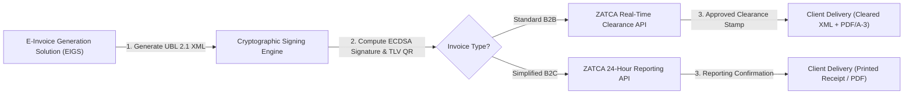
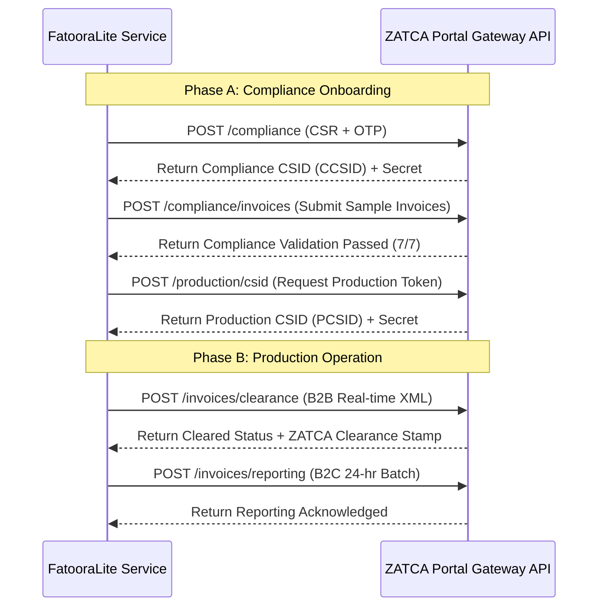

# FatooraLite Pro — ZATCA Phase-2 Technical & Regulatory Integration Guide

> [!NOTE]  
> **Regulatory Purpose**: This guide serves as the definitive technical and cryptographic reference for implementing **Saudi Arabia ZATCA (Zakat, Tax and Customs Authority) Phase-2 E-Invoicing (Integration Phase)** compliance. It covers OASIS UBL 2.1 XML specifications, ECDSA secp256k1 key structures, XAdES-BES digital signatures, Tag-Length-Value (TLV) QR codes, and ZATCA REST API gateway integration.

---

## 1. Regulatory Context & Phase-2 Requirements

Under the KSA E-Invoicing Regulations, Phase 2 (Integration Phase) mandates that taxpayers connect their Electronic Invoice Generation Solutions (EIGS) directly to ZATCA's central platform (**Fatoora Portal**).



### 1.1 Summary of Technical Standards

| Domain | Standard / Specification | Technical Specification |
| :--- | :--- | :--- |
| **Document Syntax** | OASIS Universal Business Language (UBL) 2.1 | XML schema with ZATCA KSA extension elements (`urn:oasis:names:specification:ubl:schema:xsd:Invoice-2`). |
| **Digital Signature** | W3C XMLDSig / ETSI XAdES-BES | XML Signature with `<ext:UBLExtensions>` injection; SHA-256 digest algorithms. |
| **Asymmetric Keys** | Elliptic Curve Cryptography (ECC) | **ECDSA secp256k1** curve keypairs. |
| **XML Canonicalization** | W3C Canonical XML 1.1 | **xml-exc-c14n11** (Exclusive Canonicalization 1.1 without comments). |
| **QR Code Encoding** | ZATCA TLV Base64 Encoding | 9-tag Tag-Length-Value (TLV) binary structure encoded as Base64 string. |
| **Invoice Chaining** | SHA-256 Hash Chain | Previous Invoice Hash (PIH) string embedded in each XML document. |

---

## 2. UBL 2.1 XML Invoice Structure

All invoices generated by FatooraLite Pro follow the OASIS UBL 2.1 standard with mandatory KSA custom profile identifiers.

### 2.1 Invoice Header Elements

```xml
<?xml version="1.0" encoding="UTF-8"?>
<Invoice xmlns="urn:oasis:names:specification:ubl:schema:xsd:Invoice-2"
         xmlns:cac="urn:oasis:names:specification:ubl:schema:xsd:CommonAggregateComponents-2"
         xmlns:cbc="urn:oasis:names:specification:ubl:schema:xsd:CommonBasicComponents-2"
         xmlns:ext="urn:oasis:names:specification:ubl:schema:xsd:CommonExtensionComponents-2">

    <!-- ZATCA Profile & Transaction Identifiers -->
    <cbc:ProfileID>reporting:1.0</cbc:ProfileID>
    <cbc:ID>INV-2026-00892</cbc:ID>
    <cbc:UUID>c38f12a9-6e4b-4b21-8910-47120aef7831</cbc:UUID>
    <cbc:IssueDate>2026-07-21</cbc:IssueDate>
    <cbc:IssueTime>11:30:00</cbc:IssueTime>

    <!-- Invoice Subtype Classification Code -->
    <!-- Bitmask: 0100000 = Standard (B2B), 0200000 = Simplified (B2C) -->
    <cbc:InvoiceTypeCode name="0100000">388</cbc:InvoiceTypeCode>
    <cbc:DocumentCurrencyCode>SAR</cbc:DocumentCurrencyCode>
    <cbc:TaxCurrencyCode>SAR</cbc:TaxCurrencyCode>
```

### 2.2 Accounting Supplier & Customer Party Elements

```xml
    <!-- Accounting Supplier Party (Seller Details) -->
    <cac:AccountingSupplierParty>
        <cac:Party>
            <cac:PartyIdentification>
                <cbc:ID schemeID="CRN">1010123456</cbc:ID>
            </cac:PartyIdentification>
            <cac:PostalAddress>
                <cbc:StreetName>King Fahd Road</cbc:StreetName>
                <cbc:BuildingNumber>8229</cbc:BuildingNumber>
                <cbc:PlotIdentification>4321</cbc:PlotIdentification>
                <cbc:CitySubdivisionName>Al Olaya</cbc:CitySubdivisionName>
                <cbc:CityName>Riyadh</cbc:CityName>
                <cbc:PostalZone>12643</cbc:PostalZone>
                <cac:Country><cbc:IdentificationCode>SA</cbc:IdentificationCode></cac:Country>
            </cac:PostalAddress>
            <cac:PartyTaxScheme>
                <cbc:CompanyID>310123456700003</cbc:CompanyID>
                <cac:TaxScheme><cbc:ID>VAT</cbc:ID></cac:TaxScheme>
            </cac:PartyTaxScheme>
            <cac:PartyLegalEntity>
                <cbc:RegistrationName>FatooraLite Enterprise Solutions LLC</cbc:RegistrationName>
            </cac:PartyLegalEntity>
        </cac:Party>
    </cac:AccountingSupplierParty>
```

---

## 3. Cryptographic Stamp & XAdES Signature Engine

Every e-invoice must contain an embedded digital signature constructed using the tenant's ZATCA-issued X.509 Certificate and ECDSA private key.

```
Raw UBL 2.1 XML
    │
    ├──► 1. Strip Existing Extension & QR Nodes
    ├──► 2. Canonicalize XML Structure (C14N-11)
    ├──► 3. Compute SHA-256 Digest
    ├──► 4. Sign Digest with ECDSA secp256k1 Key
    │
    └──► Inject <ext:UBLExtensions> with XAdES Signature & Certificate Base64
```

### 3.1 X.509 Certificate Signing Request (CSR) ASN.1 Specifications
When requesting a Cryptographic Stamp Identifier (CSID) from ZATCA, the generated CSR must contain explicit X.509 Subject Alt Names (SAN) and custom OIDs:

| OID / ASN.1 Field | Field Name | Description & Requirement Format |
| :--- | :--- | :--- |
| `2.5.4.3` | `CommonName` (CN) | Unique Solution Unit Name (e.g., `FatooraLite-Unit-01`). |
| `2.5.4.11` | `OrganizationalUnit` (OU) | Branch or Department Name. |
| `2.5.4.10` | `Organization` (O) | Legal Registered Entity Name. |
| `2.5.4.6` | `Country` (C) | `SA` (Saudi Arabia). |
| `2.5.4.4` | `Surname` (SN) | 1-TST for Test/Sandbox, 1-PRE for Production. |
| `2.5.4.45` | `UniqueIdentifier` (UID) | 15-digit Tax Identification Number (VAT). |
| `2.5.4.12` | `Title` (Title) | Invoice Types Allowed (`1100` for Standard & Simplified). |
| `0.9.2342.19200300.100.1.1` | `domainComponent` (DC) | Industry Category / ISIC Code. |

---

## 4. Tag-Length-Value (TLV) QR Code Specifications

ZATCA mandates a **9-Tag Tag-Length-Value (TLV)** binary structure for invoice QR codes.

```
TLV Byte Layout
[Tag 1 Byte] [Length 1 Byte] [Value Bytes...] ──► Concatenate 9 Tags ──► Base64 Encode
```

### 4.1 TLV Tag Definition Table

| Tag ID | Data Field | Encoding Format | Mandatory In |
| :---: | :--- | :--- | :--- |
| **1** | Seller Legal Name | UTF-8 String | B2C & B2B |
| **2** | Seller VAT Registration Number | 15-digit Numeric String | B2C & B2B |
| **3** | Invoice Timestamp | ISO 8601 Date/Time (`YYYY-MM-DDTHH:mm:ssZ`) | B2C & B2B |
| **4** | Invoice Grand Total (with VAT) | Decimal String formatted to 2 decimals | B2C & B2B |
| **5** | Total VAT Amount | Decimal String formatted to 2 decimals | B2C & B2B |
| **6** | Invoice Digest (SHA-256) | Base64 Encoded SHA-256 Hash of XML | B2C & B2B |
| **7** | ECDSA Digital Signature | Raw ECDSA Signature Bytes | B2C & B2B |
| **8** | ECDSA Public Key | Raw Uncompressed Public Key Bytes | B2C (Simplified) |
| **9** | ZATCA Public Key Signature | ZATCA Signature over Certificate | B2C (Simplified) |

---

## 5. ZATCA REST API Gateway Integration

FatooraLite Pro communicates directly with ZATCA's API infrastructure using mutual TLS / Basic Authentication headers containing the Base64-encoded Binary Security Token (CSID).



### 5.1 API Endpoint Matrix

| Environment | Purpose | Endpoint URL |
| :--- | :--- | :--- |
| **Sandbox / Test** | Compliance CSID Issuance | `https://gw-fatoora.zatca.gov.sa/e-invoicing/developer-portal/compliance` |
| **Sandbox / Test** | Sample Invoice Validation | `https://gw-fatoora.zatca.gov.sa/e-invoicing/developer-portal/compliance/invoices` |
| **Production** | Real-time B2B Clearance | `https://gw-fatoora.zatca.gov.sa/e-invoicing/core/invoices/clearance` |
| **Production** | 24-hour B2C Reporting | `https://gw-fatoora.zatca.gov.sa/e-invoicing/core/invoices/reporting` |

---

## 6. Error Remediation & Troubleshooting Matrix

| ZATCA Response Code | Category | Error Description | Remediation Protocol |
| :--- | :--- | :--- | :--- |
| `CF-INV-01` | Clearance | Invalid Invoice Hash Chain (PIH). | Reset hash chain pointer to last verified database transaction using `lib/zatca/pih.ts`. |
| `BR-KSA-04` | Validation | Buyer VAT Number specified without VAT scheme prefix. | Ensure buyer VAT ID is 15 digits and starts/ends with `3`. |
| `BR-KSA-27` | Compliance | XAdES Signature element missing CanonicalizationMethod C14N-11. | Re-verify canonicalization output using `scripts/validate-zatca.ts`. |
| `401 Unauthorized` | Gateway Auth | Expired or revoked Production CSID. | Regenerate a fresh 6-digit OTP from Fatoora Portal and re-issue PCSID under **Settings → ZATCA Setup**. |

---

## 7. Compliance Verification & Test Harness

FatooraLite Pro includes an independent, automated verification suite for ZATCA XMLDSig validation:

```bash
# Execute independent non-circular ZATCA validation harness
npx tsx scripts/validate-zatca.ts
```

**Verification Output Checklist**:
- `[PASS]` Keypair Generation (ECDSA secp256k1)
- `[PASS]` X.509 CSR Construction & OID Encoding
- `[PASS]` UBL 2.1 XML Invoice Generation
- `[PASS]` C14N-11 Exclusive XML Canonicalization (Ancestors Preserved)
- `[PASS]` SHA-256 Digesting & Signature Insertion
- `[PASS]` 9-Tag TLV QR Code Encoding & Base64 Verification
- `[PASS]` Previous Invoice Hash (PIH) Chaining
